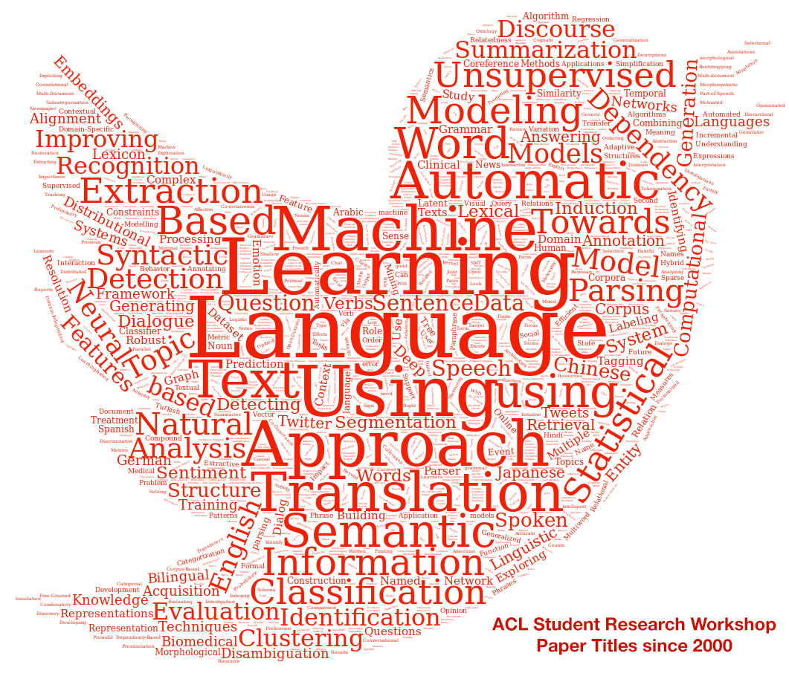
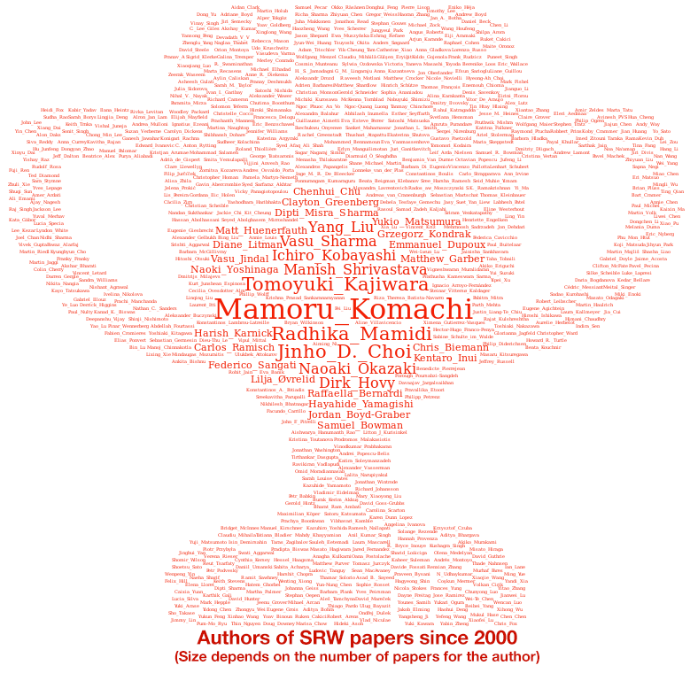

# Spotlight on the Student Research Workshop

{:height="40%" width="40%"}

One of the attractive sessions of ACL conferences is known as the Student Research Workshop (SRW).
[ACL](https://aclweb.org/adminwiki/index.php?title=***_student_session_policies) describes the aim of this session as 
allowing the students to make their first important step towards becoming a computational linguist. The large CL community
treats this session as the welcoming hub for the next generation of computational linguists.

We've asked some current researchers in the field who previously submitted to the SRW to share their experiences.

__Dr. Mohammad Salameh__, a Machine Learning Engineer at Diffbot shares how he started his journey in Computational Linguistics
through the SRW:
> My first paper in an ACL-related conference was “Reversing morphological tokenization in English-to-Arabic SMT”, which
  was submitted and accepted at the Student Research Workshop. I believe the submission was very successful, as it shaped
  the topic of my NLP research and thesis. I had a Skype conversation with my mentor afterward, and we discussed 
  several ways of improving my work and the writing as he is an expert in Arabic NLP. I met him later in 2014 at the ACL
  conference, and he introduced me to several researchers working in my area. After finishing my Ph.D., I ended up as a
  postdoc working under my mentor’s supervision.
 
Mohammad Salameh completed his PhD from the University of Alberta and later worked as a Postdoctoral Research Associate 
at the Carnegie Mellon University in Qatar.

His story is very recent. But how was this session __15__ years ago? 

__Dr. Naoki Yoshinaga__, an Associate Professor at the University of Tokyo recalled his memory of when he presented 
his work at this session back in 2004 as a PhD student.
> ACL-SRW used to be ACL Student Session (part of ACL) but it becomes
   one of the ACL workshops more than 15 years ago. When I present one paper at ACL-SRW 2004, 
   I could even have a chance to join a panel discussion on our research with senior researchers
   (Chris Brew and and Martha Palmer, if I remember correctly). It was an exceptionally great experience to me.
 
After 15 years, Dr. Naoki Yoshinaga is encouraging his students to participate in this session. He said,
> I recommended my student to submit his paper
   to ACL-SRW 2017 (and it was fortunately accepted). He had a chance
   to present his ambitious paper on situation-aware neural chatbot in
   the same slot as the main paper poster sessions, and could get some
   good feedback from the main conference audience.
>

__ACL-SRW, 2005__
A student was presenting her paper at the event. According to her,
> The very first ACL conference I attended was ACL 2005, in Michigan, Ann Arbor, where I presented a paper in the 
Student Research Workshop (SRW). I wasn’t aware of the SRW. But a few months before the submission deadline, 
Rada Mihalcea and Ted Pedersen suggested the SRW to me. They gave a tutorial at IBERAMIA 2004, the venue was my graduate 
school: The National Institute of Astrophysics, Optics and Electronics. It was thanks to them, and to the sponsorship 
provided by the ACL organization that I was able to attend, and I remain to this day, very grateful for that opportunity.

Many years later, this student is part of the large CL community and serving as a program co-chair of 
NAACL 2019. __Dr. Thamar Solorio__, who is now an Associate Professor at the University of Houston.
She added,

> Attending ACL 2005 had a long lasting impact on my career path. Before attending ACL that year, I’ve 
presented a paper at COLING in 2004, and another one at CICLing 2004, but for some reason it was until I attended ACL 
that year that it became clear to me that I wanted to be part of the *CL community. I was energized by the work 
presented there, and by meeting so many great researchers. Almost 15 years later, I’m still part of this great community
 that continues to grow every year.

At the same event of ACL-SRW 2005, __Dr. Kevin Duh__, who is a Senior Research Scientist at Johns Hopkins University Human Language Technology Center 
of Excellence (HLTCOE), presented his paper. Kevin Duh shares his inspiring story about SRW.

> I have fond memories of SRW. I submitted one of my class projects to SRW when I was in the beginning of my graduate 
school career. It was an opportunity for me to write the entire paper by myself, without relying on my PhD advisor's 
assistance. This was a very good learning experience. It made me appreciate how much goes in to a 
research paper -- starting with motivation, idea, experimental design, implementation, and finally a presentation that 
tells a story. My paper was on using __Factorial HMMs__ to 
do joint POS and NER tagging, and it was quite a confidence booster to discover later that some folks in the community 
have read it!

For the new students he added, 
> I would encourage starting students to submit to SRW by yourself (but only do so once, and do not rely on 
your advisor too much); after that, shoot for *ACL and EMNLP!

The community is growing and participation in this workshop is also growing. Since 2000, it had the largest participation in 2005 
and then in 2012. Since 2015, around 20 papers were accepted in most of the SRWs. 
{:height="70%" width="70%"}

Topics of the accepted papers in SRWs are also interesting. According to Prof. Naoki Yoshinaga,
> ACL-SRW papers are sometimes more exciting than ACL ones. ACL-SRW can accept ongoing research with new or
   unconventional goals or approaches ... The accepted papers are some times more exciting to me.

These wordclouds are made of the paper titles from SRWs in different years.

{:height="50%" width="50%"}
{:height="50%" width="50%"}

{:height="50%" width="50%"}
{:height="50%" width="50%"}
{:height="50%" width="50%"}

But not everything goes perfect always. For example, Mohammad Salameh mentioned,
> Unfortunately, I was not able to attend the conference as I did not get the 
  visa to the USA on time (got it 2 months after the end of the conference). Nevertheless, this did not stop me from 
  presenting it to the mentor by recording it. 

Thamar Solorio said, 
> It turns out that the mentor assigned to provide expert feedback 
on my research didn’t show up. My SRW mentor got stuck at the business meeting. Lucky for me, Mona Diab was a mentor 
assigned to the other presenter in my session, and she graciously saved the day by providing on-the-spot feedback for 
me. To this day, I’m a great fan of her and her work. 

Later she added,
> I truly believe that the SRW is a great channel to nurture young researchers, and it is especially beneficial to
 motivated graduate students coming from regions underrepresented at *CL conferences, where graduate advisors might, 
 understandably, focus on meeting standards for a promotion system that does not value these conferences, and where 
 travel budgets are prohibitively low. The SRW, provides the means for travel, but also the means for newcomers to 
 create a community of peers, a unique networking opportunity.  
 I hope ACL and NAACL keep the SRW going for years to come. Wishing SRW participants a great experience this year!

We also expect, this years SRWs will be able to open the welcoming door of this awesome community in front of the 
new comers. Please follow [NAACL-SRW 2019](https://naacl2019-srw.github.io) and 
[ACL-SRW 2019](https://sites.google.com/view/acl19studentresearchworkshop) 
to stay updated with the events. 

Thanks to all of the organizers, authors, and participants of the previous SRW events for bearing the torch over 
the years. You are the champions.

{:height="70%" width="70%"}

We are eagerly waiting to welcome new faces in this exciting world of Computational Linguistics.

__Acknowledgement__
I want to thank Laura Burdick, Farah Nadeem, Greg Durrett, and Na-Rae Han for helping to prepare this blog. I also
want to thank the researchers who gave us their time for sharing experiences.

